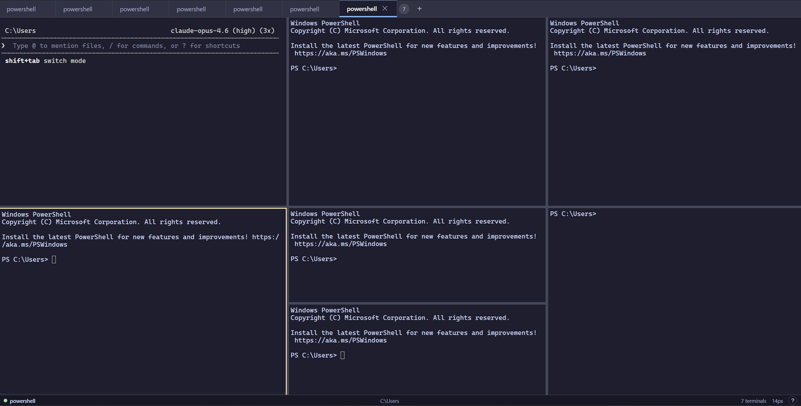

# tmax

A powerful cross-platform multi-terminal app with tiling layouts, floating panels, and a keyboard-driven workflow.

Built with Electron, React, TypeScript, xterm.js, and node-pty.

    



## Features

**Multiple Terminals in One View**
- Tiling layout with horizontal/vertical splits (binary tree, like tmux)
- Floating panels that can be dragged, resized, and maximized
- Equalize all panes to the same size with one shortcut

**Keyboard-Driven Workflow**
- Command palette (`Ctrl+Shift+P`) with every action searchable
- Jump to any terminal by name (`Ctrl+Shift+G`)
- Split, move, resize, and navigate -- all from the keyboard
- Every shortcut is fully configurable

**Drag & Drop**
- Drag tabs to split panes (left/right/top/bottom indicators)
- Drag to swap terminal positions
- Drag to detach as floating panel
- Visual drop zone labels showing exactly where the terminal will land

**Session Management**
- Auto-save/restore on close, crash, or reboot (saves every 5 seconds)
- Named layouts: save and load terminal arrangements with titles and working directories
- Startup commands per terminal -- restored when loading a layout

**Configurable Everything**
- Settings UI (`Ctrl+,`) with tabs for Terminal, Keybindings, Shells, and Theme
- Re-record any keybinding by clicking it
- Add/remove shell profiles (PowerShell, CMD, WSL, or any executable)
- Set default start folder globally or per shell
- 7 built-in color themes

## Keyboard Shortcuts

| Shortcut | Action |
|---|---|
| `Ctrl+Shift+P` | Command palette |
| `Ctrl+Shift+N` | New terminal |
| `Ctrl+Shift+W` | Close terminal |
| `Ctrl+Shift+R` | Rename terminal |
| `Ctrl+Shift+G` | Jump to terminal by name |
| `Shift+Arrow` | Move focus between panes |
| `Ctrl+Shift+Arrow` | Move/swap terminal in direction |
| `Ctrl+Alt+Arrow` | Split in that direction |
| `Ctrl+Shift+F` | Toggle float / dock |
| `Ctrl+Shift+E` | Equalize all pane sizes |
| `Ctrl+Shift+Alt+Arrow` | Resize pane |
| `Ctrl+=` / `Ctrl+-` | Zoom in / out |
| `Ctrl+0` | Reset zoom |
| `Ctrl+,` | Open settings |
| `Ctrl+Shift+/` | Show all shortcuts |

All shortcuts are remappable in Settings > Keybindings.

## Color Themes

Switch themes from the command palette (type "theme"):

- **Catppuccin Mocha** (default)
- **Dracula**
- **Nord**
- **Gruvbox Dark**
- **Tokyo Night**
- **Solarized Dark**
- **One Dark**

Or create your own in Settings > Theme with color pickers.

## Tab Context Menu

Right-click any tab for:
- Rename
- Split Right / Down
- Float / Dock
- Set Startup Command
- New Terminal (pick shell)
- Close / Close Others / Close All

## Getting Started

### Prerequisites

- Node.js 18+
- npm
- **Windows**: Visual Studio Build Tools (for node-pty native compilation)
- **macOS**: Xcode Command Line Tools (`xcode-select --install`)
- **Linux**: `build-essential`, `python3`, `libx11-dev`, `libxkbfile-dev`

### Install & Run

```bash
git clone https://github.com/InbarR/tmax.git
cd tmax
npm install
npm start
```

### Build Installer

```bash
npm run build
```

Output per platform:
- **Windows**: `out/make/squirrel.windows/x64/tmax-1.0.0 Setup.exe`
- **macOS**: `out/make/tmax-1.0.0.dmg`
- **Linux**: `out/make/deb/x64/tmax_1.0.0_amd64.deb` and `.rpm`
- **All**: portable `.zip`

### CI/CD

Push a tag to trigger cross-platform builds on GitHub Actions:

```bash
git tag v1.0.0
git push --tags
```

This builds for Windows, macOS, and Linux, and creates a GitHub Release with all artifacts.

## Architecture

```
src/
  main/           Electron main process
    main.ts         Window creation, IPC handlers
    pty-manager.ts  node-pty lifecycle management
    config-store.ts electron-store config persistence
  preload/        Secure IPC bridge (contextBridge)
  renderer/       React UI
    state/          Zustand store + binary tree layout engine
    components/     Terminal, TabBar, TilingLayout, FloatingPanel,
                    CommandPalette, Settings, DropZones, etc.
    hooks/          Keybindings, drag & drop, PTY helpers
    styles/         Global CSS (Catppuccin theme)
  shared/         IPC channel constants
```

**Key design decisions:**
- Binary tree layout engine for tmux-style tiling with arbitrary splits
- Zustand for state management (terminals, layout, focus, config)
- `@dnd-kit` for structured drag & drop with per-pane drop zones
- `node-pty` with ConPTY for native Windows terminal emulation
- `contextIsolation: true` for Electron security
- Session auto-save every 5s for crash recovery

## Configuration

Settings are stored at:
```
%APPDATA%/tmax/tmax-config.json
```

You can edit this file directly or use the Settings UI (`Ctrl+,`).

## License

MIT
